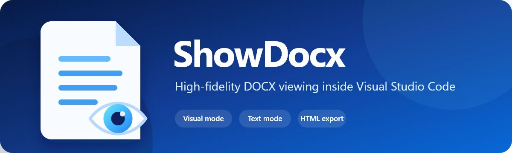
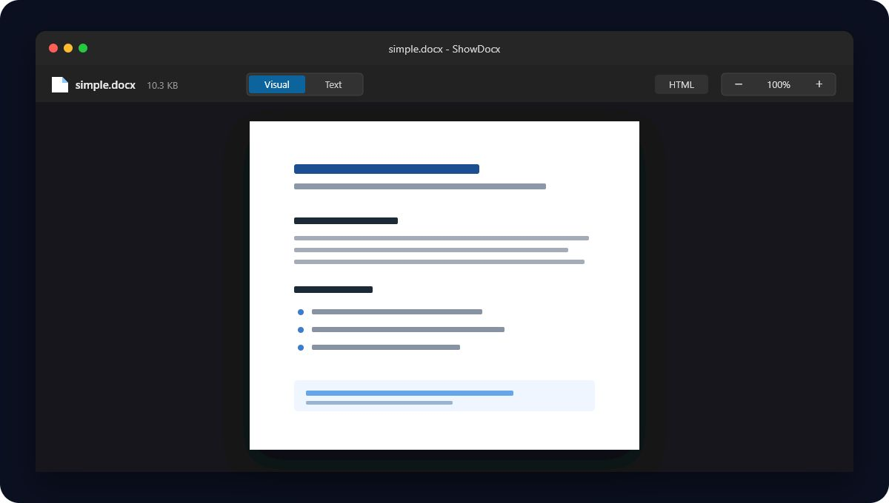

<p align="center">
  
</p>

<p align="center">
  Open and read <code>.docx</code> files directly in Visual Studio Code with page-accurate and semantic views.
</p>

<p align="center">
  <a href="https://github.com/showdocx/show-docx/actions/workflows/ci.yml"></a>
  <a href="https://github.com/showdocx/show-docx/releases"></a>
  <a href="LICENSE"></a>
</p>

## Features

- **Visual mode** renders pages, headers, footers, tables, images, footnotes, and document sizing with `docx-preview`.
- **Text mode** converts the document to clean, theme-aware semantic HTML with `mammoth`.
- **Zoom from 25% to 400%** using the toolbar or `Ctrl/Cmd` keyboard shortcuts.
- **Persistent state** remembers rendering mode, zoom, and scroll position while the editor remains open.
- **Automatic reload** updates the preview when the source file changes on disk.
- **HTML export** writes a sanitized, standalone semantic HTML document.
- **Large-file transfer** sends documents to the webview in 1 MB chunks.
- **VS Code theme support** covers light, dark, high-contrast, and forced-color modes.
- **Secure webview** uses a strict Content Security Policy, nonce-protected scripts, restricted external links, and sanitized text output.

<p align="center">
  
</p>

## Usage

1. Open any `.docx` file. ShowDocx is registered as the default custom editor.
2. Use **Visual** for the Word-like page layout or **Text** for a clean reading view.
3. Use the toolbar or `Ctrl/Cmd` + `+`, `-`, and `0` to control zoom.
4. Select **HTML** in the toolbar or run `ShowDocx: Export as HTML` from the Command Palette.

To choose ShowDocx explicitly, right-click a `.docx` file and select **Open with ShowDocx**.

## Commands

| Command | Purpose |
| --- | --- |
| `ShowDocx: Export as HTML` | Export sanitized semantic HTML |
| `ShowDocx: Zoom In` | Increase zoom by 10% |
| `ShowDocx: Zoom Out` | Decrease zoom by 10% |
| `ShowDocx: Reset Zoom` | Reset zoom to 100% |
| `ShowDocx: Toggle Visual/Text Mode` | Switch rendering engines |

## Settings

| Setting | Default | Description |
| --- | --- | --- |
| `showDocx.defaultMode` | `visual` | Initial `visual` or `text` rendering mode |
| `showDocx.defaultZoom` | `100` | Initial zoom level from 25 to 400 |
| `showDocx.maxFileSizeMb` | `100` | Maximum file size accepted by the viewer |
| `showDocx.autoReload` | `true` | Reload when the DOCX changes on disk |

## Installation

Download `show-docx-1.0.0.vsix` from the
[latest GitHub release](https://github.com/showdocx/show-docx/releases/latest), then run:

```bash
code --install-extension show-docx-1.0.0.vsix
```

You can also use **Extensions: Install from VSIX...** from the VS Code Command Palette.

## Development

```bash
npm ci
npx playwright install chromium
npm run generate:fixtures
npm run verify
npm run package
```

Press `F5` in VS Code to start the Extension Development Host and open `test/workspace/simple.docx`.

## Verification

```bash
npm run verify
```

`verify` runs linting, TypeScript checks, unit tests, VS Code Extension Host tests, and Chromium webview tests. Integration tests download a VS Code test runtime on first use. Linux environments require Xvfb.

## Architecture

ShowDocx is a `CustomReadonlyEditorProvider`. The extension host reads and watches the DOCX binary, validates size and ZIP signatures, then transfers the document to a sandboxed webview. The browser bundle selects `docx-preview` or `mammoth`, keeps rendered modes cached, and persists UI state through the VS Code webview state API.

The extension and webview are independently bundled by esbuild for Node 18 and Chromium 114, matching the minimum VS Code 1.85 runtime.

The pinned `docx-preview` compatibility changes are stored as a versioned `patch-package` patch, so local and CI builds use the same renderer code.

## Privacy

Documents are processed entirely on your machine inside the VS Code extension host and sandboxed webview. ShowDocx does not upload document contents, include telemetry, or contact an external service. External links are opened only after an explicit click.

## Known Limitations

- `.doc` binary files are not supported.
- Table of contents, bookmarks, advanced Word fields, and some hyperlinks are limited by the open-source rendering engines.
- Visual mode prioritizes page fidelity, but highly complex Word layouts may differ from Microsoft Word.
- HTML export is semantic and intentionally does not reproduce the exact page layout.
- Password-protected or encrypted documents are not supported.

## Publishing

Tags matching the package version, such as `v1.0.0`, run the full verification suite, package a VSIX, generate a SHA-256 checksum, and create a draft GitHub release. Marketplace publishing is intentionally not part of the current workflow.

## Contributing

See [CONTRIBUTING.md](CONTRIBUTING.md).

Security issues should be reported according to [SECURITY.md](SECURITY.md).

## License

[MIT](LICENSE)
