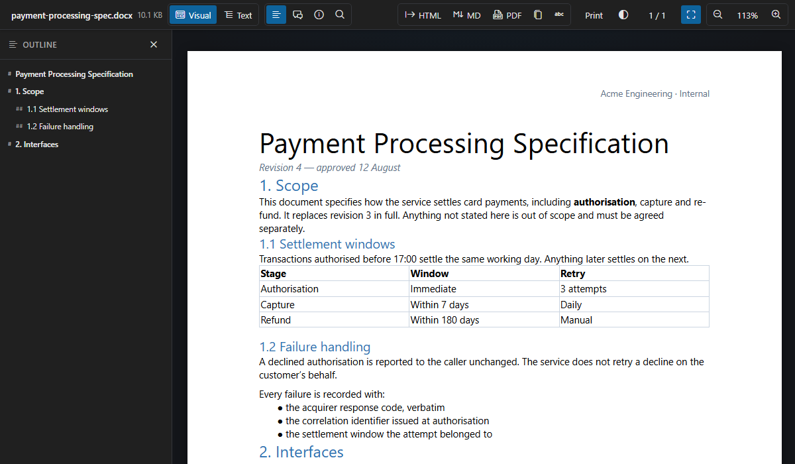

<p align="center">
  
</p>

<p align="center">
  Open and read Word documents — <code>.docx</code>, <code>.docm</code>, <code>.dotx</code>, <code>.dotm</code> — directly in Visual Studio Code with page-accurate and semantic views.
</p>

<p align="center">
  <a href="https://github.com/showdocx/show-docx/actions/workflows/ci.yml"></a>
  <a href="https://marketplace.visualstudio.com/items?itemName=showdocx.show-docx"></a>
  <a href="https://marketplace.visualstudio.com/items?itemName=showdocx.show-docx"></a>
  <a href="https://github.com/showdocx/show-docx/releases"></a>
  <a href="LICENSE"></a>
</p>

## Features

- **Visual mode** renders the Word page layout — headers, footers, tables, images, footnotes, and document sizing — with `docx-preview`. Pages are broken where the document declares a break, not repaginated.
- **Text mode** converts the document to clean, theme-aware semantic HTML with `mammoth`.
- **Compare with HEAD** opens a `.docx` and its committed revision side by side in VS Code's own diff editor. Git reports a DOCX as `Binary files differ`; ShowDocx converts both revisions to readable text so the diff shows what actually changed.
- **Readable by AI agents in your editor**: ShowDocx registers a language model tool, so Copilot agent mode and anything else using the same API can read a `.docx` instead of seeing binary. ShowDocx calls no model and sends nothing anywhere.
- **Search inside every Word document in the workspace**. VS Code's own search skips these files because they are binary, so a folder of specifications cannot answer "which one mentions this clause?" without opening each by hand.
- **In-document search** (`Ctrl/Cmd + F`) with real-time text highlighting and match navigation.
- **Document outline (TOC)** sidebar to quickly inspect headings and jump to sections.
- **Comments and tracked changes** sidebar listing reviewer notes, additions, and deletions. Available in Visual mode; `mammoth` does not carry annotations into Text mode.
- **Copy to the clipboard** as Markdown or plain text, in one click. Most of the time the content is wanted in an issue, a message or a code comment rather than in a file.
- **Fit to width and fit to page**, held against the panel size, plus `Ctrl/Cmd` + wheel for continuous zoom.
- **Export formats**: sanitized semantic HTML, Markdown (`.md`), or printable HTML that opens your browser's print dialog for **Save as PDF**. The printable file carries the Visual-mode page layout — page breaks, headers, footers, tables and embedded images.
- **Page themes** for Visual mode: paper, sepia, or dark. Most VS Code users run a dark theme; an 80-page white document does not have to be the only option.
- **Zoom from 25% to 400%** using the toolbar, `Ctrl/Cmd` keyboard shortcuts, or `Ctrl/Cmd` + the mouse wheel.
- **Hidden tabs are released**, so open documents do not hold their rendered pages in memory while nobody is looking at them. Returning to a tab re-renders and lands back where you were; `showDocx.retainHiddenTabs` trades that back for memory.
- **Persistent state** remembers rendering mode, zoom, page theme, and reading position per document, across sessions. Close a specification and reopen it next week where you left it.
- **Automatic reload** updates the preview when the source file changes on disk.
- **Large-file transfer** sends documents to the webview in 1 MB chunks.
- **VS Code theme support** covers light, dark, high-contrast, and forced-color modes.
- **Secure webview** uses a strict Content Security Policy, nonce-protected scripts, restricted external links, and sanitized text output.

<p align="center">
  
</p>

## Usage

1. Open any `.docx`, `.docm`, `.dotx` or `.dotm` file. ShowDocx is registered as the default custom editor for all four; they are the same OOXML package, and a macro is never executed.
2. Use **Visual** for the Word-like page layout or **Text** for a clean reading view.
3. Press `Ctrl/Cmd + F` to search within the document.
4. Open the **Outline** or **Comments** sidebars from the toolbar to navigate structure and reviews.
5. Use the toolbar or `Ctrl/Cmd` + `+`, `-`, and `0` to control zoom.
6. Export the document as **HTML** or **MD** (Markdown) from the toolbar or Command Palette. **PDF** saves printable HTML of the page layout and opens it in your browser, where **Print → Save as PDF** produces the file. It prints the pages you see in Visual mode, whichever mode you started the export from.

To choose ShowDocx explicitly, right-click a `.docx` file and select **Open with ShowDocx**.

### Searching across documents

Run **ShowDocx: Search in Word Documents** from the Command Palette and type. Matches from every Word document in the workspace appear as you type, with the line they were found on; choosing one opens the document with the term already in its search bar.

Text is read straight out of each document's XML and cached against the file's modification time, so the first search reads the files and later ones are immediate. Headers and footers are searched too — that is where a document number or title usually lives. Field codes and text removed by a tracked change are not, because neither is text the reader sees.

The API that would put these results in VS Code's own search panel is still proposed, so this is a separate command for now.

### Comparing revisions

Right-click a `.docx` in the Explorer and choose **Compare with HEAD**, or run it from the editor title bar or the Command Palette. Both revisions open in the normal diff editor as text.

The text is shaped for diffing rather than for reading: one line per paragraph and per table row, ordered list items all written `1.`, and embedded images reduced to a short digest of their bytes. Word rewrites the whole package on every save, so without that normalization each revision would read as a full rewrite. A one-word edit shows up as one changed line.

Requires `git` on the `PATH`, or the `git.path` setting. Deletions in tracked changes are not shown, for the same reason Text mode does not show them.

### Letting an agent read a document

An AI agent running in your editor cannot read a `.docx`: opening one returns a ZIP archive. ShowDocx registers a `showdocx_readDocx` language model tool that returns the document as Markdown, so the agent can read `spec.docx` the way it reads any other file. Reference it in a prompt as `#docx`.

**ShowDocx calls no model.** Your own agent, on your own subscription, asks this extension for text it already knows how to produce. There is no API key, no cost and no outbound request — the privacy guarantee below holds exactly as written.

Only documents inside the open workspace can be read, and only `.docx` files. A model's arguments can be steered by whatever it has read, so the tool treats a path as a request rather than a permission.

The tool needs VS Code 1.95 or later. ShowDocx still declares support from 1.85, detects the API at runtime, and simply does not register the tool where it is absent.

## Commands

| Command | Purpose |
| --- | --- |
| `ShowDocx: Compare with HEAD` | Compare the document with its committed revision in the diff editor |
| `ShowDocx: Find in Document` | Open in-document search bar (`Ctrl/Cmd + F`) |
| `ShowDocx: Search in Word Documents` | Search inside every Word document in the workspace |
| `ShowDocx: Export as HTML` | Export sanitized semantic HTML |
| `ShowDocx: Export as Markdown` | Export clean Markdown document (`.md`) |
| `ShowDocx: Copy as Markdown` | Put the document on the clipboard as Markdown |
| `ShowDocx: Copy as Plain Text` | Put the document on the clipboard with no markup |
| `ShowDocx: Print to PDF (via Browser)` | Save printable HTML and open your browser's print dialog (`Ctrl/Cmd + Alt + P`) |
| `ShowDocx: Zoom In` | Increase zoom by 10% |
| `ShowDocx: Zoom Out` | Decrease zoom by 10% |
| `ShowDocx: Reset Zoom` | Reset zoom to 100% |
| `ShowDocx: Fit Page to Width` | Scale the page to the panel width, and hold it as the panel is resized |
| `ShowDocx: Fit Whole Page` | Scale so a whole page is visible |
| `ShowDocx: Toggle Visual/Text Mode` | Switch rendering engines |
| `ShowDocx: Change Page Theme` | Cycle the Visual-mode page between paper, sepia, and dark |
| `ShowDocx: Show Log` | Open the ShowDocx log channel for diagnosing a failure |

## Settings

| Setting | Default | Description |
| --- | --- | --- |
| `showDocx.defaultMode` | `visual` | Initial `visual` or `text` rendering mode |
| `showDocx.defaultZoom` | `100` | Initial zoom level from 25 to 400 |
| `showDocx.maxFileSizeMb` | `100` | Maximum file size accepted by the viewer |
| `showDocx.autoReload` | `true` | Reload when the DOCX changes on disk |

## Installation

Install [ShowDocx from the Visual Studio Marketplace](https://marketplace.visualstudio.com/items?itemName=showdocx.show-docx), search for `ShowDocx` in the VS Code Extensions view, or run:

```bash
code --install-extension showdocx.show-docx
```

For manual or offline installation, download `show-docx-1.1.1.vsix` from the
[latest GitHub release](https://github.com/showdocx/show-docx/releases/latest), then run:

```bash
code --install-extension show-docx-1.1.1.vsix
```

You can also use **Extensions: Install from VSIX...** from the VS Code Command Palette.

## Development

```bash
npm ci
npx playwright install chromium
npm run generate:fixtures
npm run verify
npm run package
```

Press `F5` in VS Code to start the Extension Development Host and open `test/workspace/simple.docx`.

## Verification

```bash
npm run verify
```

`verify` runs linting, TypeScript checks, unit tests, VS Code Extension Host tests, and Chromium webview tests. Integration tests download a VS Code test runtime on first use. Linux environments require Xvfb.

## Architecture

ShowDocx is a `CustomReadonlyEditorProvider`. The extension host reads and watches the DOCX binary, validates size and ZIP signatures, then transfers the document to a sandboxed webview. The browser bundle selects `docx-preview` or `mammoth`, keeps rendered modes cached, and persists UI state through the VS Code webview state API.

The extension and webview are independently bundled by esbuild for Node 18 and Chromium 114, matching the minimum VS Code 1.85 runtime declared in `engines`.

The pinned `docx-preview` compatibility changes are stored as a versioned `patch-package` patch, so local and CI builds use the same renderer code.

## Privacy

Documents are processed entirely on your machine inside the VS Code extension host and sandboxed webview. ShowDocx does not upload document contents, include telemetry, or contact an external service. External links are opened only after an explicit click, and not at all while the workspace is untrusted.

## Known Limitations

- `.doc` binary files are not supported. No reliable pure-JavaScript reader exists for the legacy format, and half-working output is worse than none.
- Markdown output — exported, copied, or read by an agent — replaces an embedded image with a short placeholder rather than inlining megabytes of base64.
- Text mode shows tracked changes as accepted: `mammoth` drops deletions and inlines insertions. The viewer says so in its rendering notes; use Visual mode to see the markup.
- The comments sidebar reads annotations from the Visual-mode render, so it is empty in Text mode.
- Search matches at most 2000 results per query, shown as `2000+`. Workspace search shows at most 300 matches, and at most 20 per document.
- Table of contents, bookmarks, advanced Word fields, and some hyperlinks are limited by the open-source rendering engines.
- Visual mode prioritizes page fidelity, but highly complex Word layouts may differ from Microsoft Word.
- HTML export is semantic and intentionally does not reproduce the exact page layout; the PDF export does.
- If Visual mode cannot render a document at all, the PDF export falls back to the semantic text view rather than failing.
- Comparing revisions covers `HEAD` and local files. Comparing two selected documents, arbitrary revisions, and following a rename are not implemented yet.
- Password-protected or encrypted documents are not supported.

## Publishing

Tags matching the package version, such as `v1.1.1`, run the full verification suite, package a VSIX, generate a SHA-256 checksum, and create a draft GitHub release.

Stable releases are also published under the `showdocx` publisher on the
[Visual Studio Marketplace](https://marketplace.visualstudio.com/items?itemName=showdocx.show-docx). Marketplace publishing is currently a separate manual release step.

## Contributing

See [CONTRIBUTING.md](CONTRIBUTING.md).

Security issues should be reported according to [SECURITY.md](SECURITY.md).

## License

[MIT](LICENSE)
